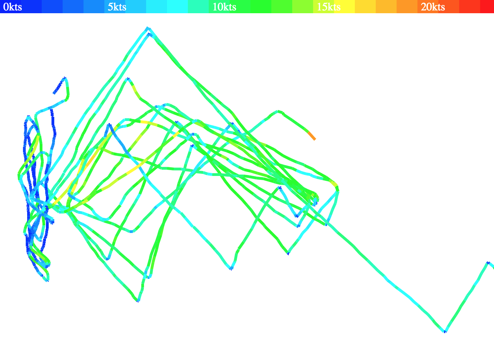

Simple GPS track processor for sailing race tracks.

* reads all gpx files specified on the command line
* pulls out all segments
* discards any duplicate or superfluous (very short) segments
* combines segments that are no more than 1h apart into a track
* renders each track into an svg file
* saves each track into a new gpx file
* optionally generates subtitles file with gps metrics that can be embedded in a video file (more below)



`samples/out` directory contains files generated from the input files in `samples/in` directory.

The output files can be regenerated as follows:
```
$ rm samples/out/*; make && ./gpx -o samples/out -vo 0s samples/in/*
Dropped 32 duplicate and bogus segments
16-05-25 17:56:07 16.09nm 01.32nm x 00.86nm (2h21m36s)
16-06-01 18:57:23 06.76nm 01.08nm x 00.57nm (1h11m2s)
16-06-04 11:03:46 04.89nm 01.25nm x 00.52nm (1h23m41s)
16-06-05 09:56:20 23.06nm 01.71nm x 01.98nm (3h1m4s)
16-06-22 17:51:25 18.56nm 01.42nm x 00.71nm (2h29m44s)
16-07-26 18:48:29 04.04nm 01.41nm x 00.76nm (42m51s)
16-08-08 18:29:00 01.61nm 00.73nm x 00.17nm (13m45s)
16-08-17 18:20:50 04.37nm 01.28nm x 00.58nm (59m19s)
16-08-20 17:34:32 10.07nm 01.70nm x 01.98nm (1h12m42s)
16-08-24 17:50:55 14.82nm 01.31nm x 00.71nm (2h4m15s)
```

## gps video subtitles

It is nice to be able to overlay GPS information over the video that you may have recorded on your boat. There are many guides out there showing how to use video editors to render cute measurement gauges into your video recording. It can look pretty good but is very manual and time consuming.

An alternative approach that isn't as artistic but is simple and fast, because you don't have to re-encode the whole video, is to use subtitles to show the GPS information. It's text only, no graphics but can convey most of the same information. Adding subtitles to a video is nearly instant compared to rerendering the full video.

This tool can spit out a subtitles file for your video with following GPS stats:

```
time: distance @ speed ↑ heading = total distance`
```

It will looks something like this

```
17:51:43: 26.8 m @ 5.8 kts ↑ 33° NNE = 0.07 nm
```

The subtitle granularity matches the granularity of the gps track, i.e. new subtitle for each track point.

The subtitle file generation is gated by the `-vo` flag that requires a "video offset" duration as its argument. This is because the start of the gps track more than likely doesn't align with the start of the video. The offset specifies how much are they off. Positive offset means the video starts before the gps track, negative offset means the video starts after the gps track. If miraculously they align perfectly set offset to 0.

### figuring out video offset

#### when camera and gps watch time is the same

If you can make sure that the clocks on the camera and on the gps device are in sync, you can use `ffmpeg` to lift the `creation_time` off the video as follows:

```
ffprobe -show_entries format_tags=creation_time -of csv=print_section=0 <the-video-file>
```

That should give you something like `2024-08-24T15:08:29.000000Z`. Note that if the timezone is set to Z it's quite likely local time, not UTC.

Then check the timestamp in the beginning of your gpx file, it could look something like this

```
  ...
  <metadata>
    <link href="connect.garmin.com">
      <text>Garmin Connect</text>
    </link>
    <time>2024-08-24T19:01:05.000Z</time>
  </metadata>
``` 

This one likely is in UTC, so you'll need to convert to local time. Then simply subtract the video timestamp from the gpx timestamp to get the video offset.

#### when camera and gps watch time is not the same

Unless you prepared well and made sure the camera and gps device clocks are in sync, then they most likely are not. In that case you need to figure out how much they are off and add that difference to the video offset as well.

You may be able to check the time on both after the fact and figure out the difference that way.

Another option, if you think about this ahead of time is to just record your GPS watch on the video when you start recording, that way you'll have a fairly good idea of what the watch time was at a given point in the video, it should be easy to calculate the offset from that. You just have to make sure you have a reasonably clear and sharp picture of your watch. I find that I can bring my watch about 6 inches from my old GoPro session and hold it there for a second to let the camera focus.

## adding subtitles to a video file (using ffmpeg)

Let's assume you have video.mp4 and subtitles.vtt that you successfully produced with this tool. Here's how you can add the subtitles

```
ffmpeg -i video.mp4 -i subtitles.vtt -map 0:v -map 0:a -map 1:s -map_metadata 0 -c copy -c:s mov_text -metadata:s:s:0 language=eng -y video-with-subtitles.mp4
```
Here's what the bits of the command mean:

-i video.mp4    = use this video file
-i subtitles.vtt = use this subtitle file
-map 0:v        = take the video stream from the video file
-map 0:a        = take the audio stream from the video file
-map 1:s        = take the subtitle stream from the subtitle file
-map_metadata 0 = take the metadata from the video file
-c copy         = don't process the video/audio just copy it over as is
-c:s mov_text   = encode the subtitle stream in a way that works with mp4 container
-metadata:s:s:0 language=eng = set the subtitles language to english (that's how it will show in subtitle options in the player)
-y              = just (over)-write the final file don't ask for confirmation
video-with-subtitles.mp4 = name of the video file with subtitles

This should produce a new video file with the same content as the original file with the subtitle stream added into it. It should be fast because the video content is just copied over as is without re-processing.

Here's a screenshot of the subtitles shown in a video


Note that you may need to enable subtitles in your video player to have them show up.


## References
* https://gist.github.com/spirillen/af307651c4261383a6d651038a82565d
* https://grep.be/blog/en/computer/play/Adding_subtitles_with_FFmpeg/
* https://www.bannerbear.com/blog/how-to-add-subtitles-to-a-video-file-using-ffmpeg/
* https://developer.mozilla.org/en-US/docs/Web/API/WebVTT_API/Web_Video_Text_Tracks_Format
